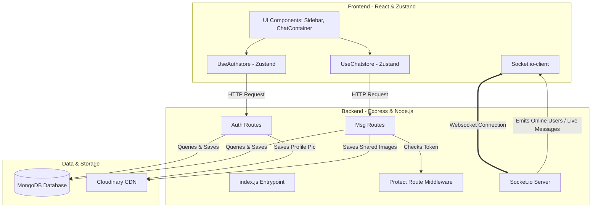
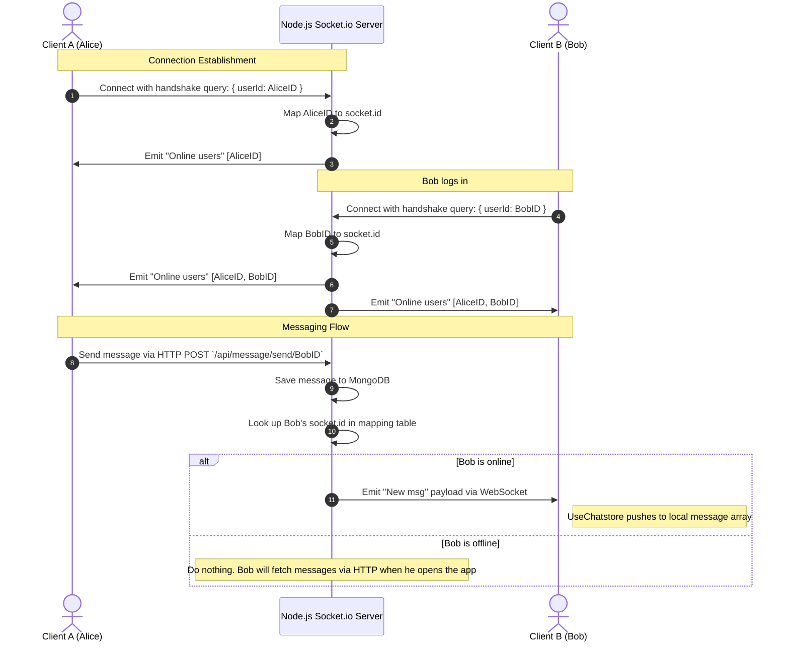

# Architecture Design (`archi.md`) 🗺️

This document describes the high-level architecture, data flow, and components of **WhatZap**.

---

## 🏛️ System Architecture Overview

WhatZap follows a decoupled **Client-Server Architecture** utilizing HTTP REST APIs for standard CRUD operations (authentication, profile updates, pulling historical messages) and WebSockets (via Socket.io) for real-time bidirection communication (sending/receiving messages, and checking online users).

---

## 💾 Data Models & Persistence

WhatZap uses MongoDB to persist user identities and chat histories.

### 1. User Schema (`back/src/models/user.js`)
Stores registered accounts and reference data for authentication.
*   `email` (String, required, unique): The login credentials email.
*   `fullname` (String, required): Display name of the user.
*   `password` (String, required, minLength: 6): Encrypted password hashed with `bcryptjs`.
*   `profilepic` (String, default: `""`): Cloudinary image URL representing the user's avatar.
*   `timestamps` (automatic): tracks `createdAt` and `updatedAt` values.

### 2. Message Schema (`back/src/models/message.js`)
Stores individual message payloads exchanging between contacts.
*   `senderId` (ObjectId referencing `User`, required): The sender's ID.
*   `receiverId` (ObjectId referencing `User`, required): The receiver's ID.
*   `text` (String, optional): The textual context of the message.
*   `image` (String, optional): Cloudinary image URL of any attached image.
*   `timestamps` (automatic): tracks `createdAt` and `updatedAt` values.

---

## 🔄 Real-time Communication Flow (Socket.io)

Real-time message forwarding is handled by pairing active user connections in an memory-mapped dictionary on the backend.

---

## 🔐 Authentication & Session Flow

The app enforces stateless session protection using secure cookies.

1.  **Signup / Login**: User submits credentials to `/api/auth/signup` or `/api/auth/login`.
2.  **JWT Issuance**: The server generates a JWT containing the user's MongoDB `_id` and sets it as an `httpOnly`, `sameSite: "strict"`, secure cookie named `jwt`.
3.  **Route Protection**: For any protected endpoint (like fetching messages or checking authentication):
    *   The `protectRoute` middleware intercepts the request.
    *   It retrieves the `jwt` cookie.
    *   If valid, it extracts `userId`, loads user credentials from MongoDB (excluding password), and appends it to `req.user` before calling `next()`.
4.  **Logout**: Clears the `jwt` cookie by setting `maxAge` to `0`.
